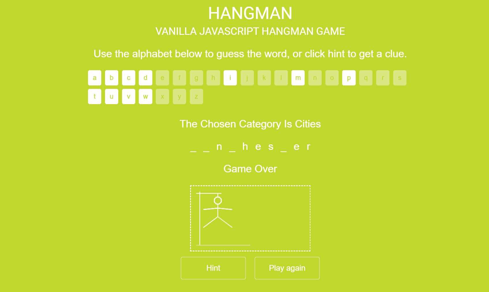

# Create a game

## Overview
Create a hangman game!  
Example of what we want to accomplish

### Requirements

1. HTML:
    1. Add buttons that correspond to each letter from a to z.
    2. Add a section that will hold the blanks that are going to be equal to the number of characters for the current word.
    3. Add a div to show the man who's going to be hanged if you lose.
    4. Add a counter from 10 that will decrease by 1 with every wrong guess.
    4. Add a button to play again.

2. JS:
    1. At the beginning use fetch API to retrieve a random word from this api https://random-word-api.herokuapp.com/word?number=1. Make the blanks equal the number of letters in the random word.
    2. Everytime the user clicks on one of the letters the following should happen:
        1. The random word is search through to find if it contains the clicked letter, if the clicked letter is part of the random word's letters then it gets shown up instead of the space, if not, then the lives counter is decreased by one. In some rare cases a clicked letter corresponds to two letters in the generated word, if that happens then show both words.
        2. The button becomes disabled and should only work once.
    3. If the lives counter reaches 0 then the game is over and the hangman should be HANGED! 👨‍🦱🔪
    4. Clicking on the play again button should do the whole process again.

NOTE: Be creative with the game's mechanics and design!!! 
Have fun, and Good luck :D 